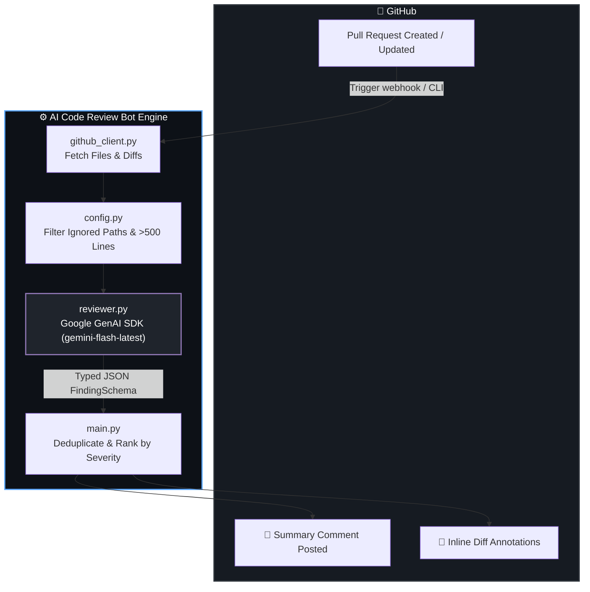

<div align="center">

# 🤖 AI Code Review Bot
### *Automated, High-Precision Code Reviews Powered by Google Gemini & GitHub Actions*

[](https://www.python.org/)
[](https://ai.google.dev/)
[](https://github.com/features/actions)
[](https://pygithub.readthedocs.io/)
[](LICENSE)

<br />

[🚀 Quick Start](#-quick-start) •
[✨ Key Features](#-features) •
[📊 Architecture](#-system-architecture) •
[🛠️ Configuration](#-configuration) •
[🔧 Troubleshooting (10 Solutions)](#-troubleshooting-faq)

<br />

---

</div>

## 🌟 Overview

**AI Code Review Bot** is a production-ready, autonomous pull-request reviewer. It inspects unified Git diffs, prompts Google's Gemini models with strict JSON output schemas, and publishes structured feedback back to GitHub — featuring both a **high-level summary matrix** and **inline per-line diff annotations**.

> 💡 **Why use this?** Catch SQL injections, memory leaks, missing null-checks, and anti-patterns *before* human reviewers even open the PR.

---

## ✨ Features

<table>
  <tr>
    <td width="50%">
      <h3>🎯 100% Structured Schema</h3>
      <p>Powered by Google GenAI's <code>response_schema</code> for guaranteed JSON adherence without fragile text regex parsing.</p>
    </td>
    <td width="50%">
      <h3>💬 Inline Diff Annotations</h3>
      <p>Attaches actionable recommendations directly on the offending line of code in the PR diff.</p>
    </td>
  </tr>
  <tr>
    <td width="50%">
      <h3>🚦 Smart Severity Triage</h3>
      <p>Ranks findings into <code>🔴 CRITICAL</code>, <code>🟡 WARNING</code>, and <code>🔵 MINOR</code> with configurable minimum posting thresholds.</p>
    </td>
    <td width="50%">
      <h3>🛡️ Safe Cost Guardrails</h3>
      <p>Automatically filters lockfiles, build artifacts, generated assets, and files exceeding diff length limits.</p>
    </td>
  </tr>
  <tr>
    <td width="50%">
      <h3>🔄 Intelligent Deduplication</h3>
      <p>Combines overlapping issues on the same file/line/category and preserves the highest severity assessment.</p>
    </td>
    <td width="50%">
      <h3>⚡ Dual-Mode Execution</h3>
      <p>Run locally via CLI with <code>--dry-run</code> for tuning, or run autonomously in CI/CD on every PR open/update.</p>
    </td>
  </tr>
</table>

---

## 📊 System Architecture



---

## 📁 Repository Blueprint

```bash
code_review_bot/
├── 📄 main.py              # CLI entrypoint, argument parsing, dedup, execution orchestrator
├── 📄 github_client.py     # GitHub API interface (fetch patches, post comments, commit SHAs)
├── 📄 reviewer.py          # Gemini AI core (typed schema, system instructions, review logic)
├── 📄 models.py            # Finding dataclass & markdown rendering engine
├── 📄 config.py            # Path filters, severity thresholds, max file caps
├── 📄 requirements.txt     # Locked production dependencies
├── 📄 .env.example         # Template for environment credentials
└── 📂 .github/workflows/
    └── 📄 review.yml       # Production-ready GitHub Actions workflow
```

---

## 🚀 Quick Start

### 1️⃣ Clone & Set Up Environment

```bash
# Clone the repository
git clone https://github.com/your-username/your-repo.git
cd your-repo

# Create and activate virtual environment
python -m venv .venv

# Windows (Command Prompt):
.venv\Scripts\activate
# Windows (PowerShell):
.\.venv\Scripts\Activate.ps1
# macOS / Linux:
source .venv/bin/activate

# Install required dependencies
pip install -r requirements.txt
```

---

### 2️⃣ Configure Credentials

1. Copy `.env.example` to `.env`:
   ```bash
   cp .env.example .env
   ```
2. Populate your secrets:
   ```env
   # GitHub Personal Access Token (classic with 'repo' scope)
   GITHUB_TOKEN=ghp_your_github_token_here

   # Google Gemini API Key from https://aistudio.google.com/
   GEMINI_API_KEY=your_gemini_api_key_here
   ```

---

### 3️⃣ Test Run in Terminal (Dry-Run Mode)

Test against any open pull request without modifying GitHub:

```bash
python main.py --repo your-org/your-repo --pr 1 --dry-run
```

#### 📋 Sample Review Output:
```markdown
========================================================================
DRY RUN — Summary comment that would be posted:
========================================================================
## 🤖 AI Code Review

Automated review generated by **gemini-code-reviewer**.
Findings are ordered by severity. Please address **critical** issues before merging.

Found **2** issue(s): **1** critical, **1** warning.

| Severity | Category | File | Line | Issue |
|---|---|---|---|---|
| 🔴 Critical | `security` | `test_feature.py` | 8 | Direct string interpolation into SQL query allows SQL injection. Use parameterized query. |
| 🟡 Warning | `bug` | `test_feature.py` | 5 | Database connection opened but never closed. Use context manager or conn.close(). |

---
_This review was generated automatically. False positives may occur — use your own judgement._
========================================================================
```

---

### 4️⃣ Live Execution via CLI

To publish findings directly to GitHub:

```bash
python main.py --repo your-org/your-repo --pr 1
```

---

## ⚡ GitHub Actions CI/CD Integration

To automatically review every incoming Pull Request:

1. **Add Repository Secret**:
   - Go to your repository on GitHub: **Settings → Secrets and variables → Actions → New repository secret**.
   - **Name**: `GEMINI_API_KEY`
   - **Value**: Your Gemini API Key from Google AI Studio.

2. **Enable Workflow Permissions**:
   - Go to **Settings → Actions → General → Workflow permissions**.
   - Select **Read and write permissions**.
   - Check **Allow GitHub Actions to create and approve pull requests**.
   - Click **Save**.

3. **Open a PR**: Open any Pull Request — the bot will review and post feedback automatically!

---

## ⚙️ CLI Reference

```
usage: main.py [-h] --repo OWNER/NAME --pr NUMBER [--token GHTOKEN]
               [--gemini-key API_KEY] [--dry-run]
               [--min-severity {critical,warning,minor}] [--model MODEL]
               [--verbose]

Options:
  --repo OWNER/NAME       GitHub repository in owner/name format (e.g. your-org/your-repo)
  --pr NUMBER             Pull request number to review (e.g. 42)
  --token GHTOKEN         GitHub token (defaults to GITHUB_TOKEN environment variable)
  --gemini-key API_KEY    Gemini API key (defaults to GEMINI_API_KEY or GOOGLE_API_KEY)
  --dry-run               Print to stdout instead of posting comments to GitHub
  --min-severity LEVEL    Minimum severity to post inline [critical | warning | minor] (default: warning)
  --model MODEL           Gemini model identifier (default: gemini-flash-latest)
  -v, --verbose           Enable debug logging output
```

---

## 🛠️ Configuration (`config.py`)

| Setting | Default | Description |
|---|---|---|
| `IGNORED_PATHS` | `['node_modules', '.lock', 'dist/', ...]` | File patterns skipped from AI analysis |
| `MIN_SEVERITY_TO_POST` | `"warning"` | Cutoff threshold for inline annotations |
| `MAX_FILES_PER_RUN` | `20` | Cap on files reviewed per run to control token spend |
| `MAX_DIFF_LINES_PER_FILE` | `500` | Safety limit to prevent reviewing oversized diffs |

---

## 🔧 Troubleshooting & FAQ

<details>
<summary><b>1. Virtual environment activation error on Windows</b></summary>
<br/>

**Symptom:**
```
/.venv/Scripts/activate : The system cannot find the path specified.
```
**Fix:**
- Windows Command Prompt requires backslashes: `.venv\Scripts\activate`
- In PowerShell, run: `Set-ExecutionPolicy -ExecutionPolicy RemoteSigned -Scope CurrentUser` and then `.\.venv\Scripts\Activate.ps1`
</details>

<details>
<summary><b>2. Pip download errors ([Errno 11001] getaddrinfo failed)</b></summary>
<br/>

**Symptom:**
```
WARNING: Retrying ... [Errno 11001] getaddrinfo failed
```
**Fix:**
- Pip automatically retries up to 5 times. If your DNS is slow, allow it to complete.
- Or pass trusted hosts:
  ```cmd
  pip install -r requirements.txt --trusted-host pypi.org --trusted-host files.pythonhosted.org
  ```
</details>

<details>
<summary><b>3. GitHub API 404 Not Found</b></summary>
<br/>

**Symptom:**
```
[ERROR] github_client: GitHub API error fetching PR files: 404 {"message": "Not Found"}
```
**Fix:**
- Verify the Pull Request is open at `https://github.com/<owner>/<repo>/pull/<number>`.
- If the repository is private, ensure your `GITHUB_TOKEN` has the `repo` scope enabled at [GitHub Tokens](https://github.com/settings/tokens).
</details>

<details>
<summary><b>4. Gemini model 404 NOT_FOUND or Deprecation errors</b></summary>
<br/>

**Symptom:**
```
ClientError: 404 NOT_FOUND. Model is no longer available to new users.
```
**Fix:**
- Use the stable alias **`gemini-flash-latest`** (configured as default in `reviewer.py` and `main.py`).
</details>

<details>
<summary><b>5. Gemini API Key prefix (AQ.Ab... vs AIzaSy...)</b></summary>
<br/>

**Question:**
> *"My API key starts with `AQ.Ab...`. Is that supported?"*

**Answer:**
- Yes. Google AI Studio produces keys with various prefixes based on region and tier. The bot passes the full key string directly to the Google GenAI client.
</details>

<details>
<summary><b>6. Windows Unicode / Emoji encoding crash (UnicodeEncodeError: 'charmap')</b></summary>
<br/>

**Symptom:**
```
UnicodeEncodeError: 'charmap' codec can't encode character '\U0001f916'
```
**Fix:**
- `main.py` automatically configures UTF-8 encoding on startup.
- In legacy consoles, run `chcp 65001` before executing Python scripts.
</details>

<details>
<summary><b>7. GitHub Actions 403 Resource not accessible by integration</b></summary>
<br/>

**Symptom:**
```
403 {"message": "Resource not accessible by integration"}
```
**Fix:**
- In your repository settings: Go to **Settings → Actions → General → Workflow permissions** → Select **Read and write permissions** and click **Save**.
</details>

<details>
<summary><b>8. PowerShell chaining error (The token '&&' is not a valid separator)</b></summary>
<br/>

**Symptom:**
```
The token '&&' is not a valid statement separator in this version.
```
**Fix:**
- In Windows PowerShell, use a semicolon `;` instead of `&&`:
  ```powershell
  git add -A; git commit -m "message"; git push origin main
  ```
</details>

<details>
<summary><b>9. Inline comments not posting on specific lines</b></summary>
<br/>

**Symptom:**
```
Could not post inline comment on file:line
```
**Fix:**
- GitHub's review comment API only allows inline annotations on lines present in the PR's unified diff. Issues identified on unmodified lines are automatically included in the top-level Summary Matrix instead.
</details>

<details>
<summary><b>10. Missing environment variable error</b></summary>
<br/>

**Symptom:**
```
[ERROR] main: No Google Gemini API key provided.
```
**Fix:**
- Ensure your `.env` file exists in the project root containing `GEMINI_API_KEY=...` and `GITHUB_TOKEN=...`, or pass them explicitly via `--gemini-key` and `--token`.
</details>

---

## 🤝 Contributing

1. Fork the Project
2. Create your Feature Branch (`git checkout -b feature/AmazingFeature`)
3. Commit your Changes (`git commit -m 'feat: Add AmazingFeature'`)
4. Push to the Branch (`git push origin feature/AmazingFeature`)
5. Open a Pull Request & let the bot review your PR! 🎉

---

## 📄 License

Distributed under the **MIT License**. See [LICENSE](LICENSE) for more information.

<div align="center">
  <sub>Built with ❤️ using Google Gemini & GitHub Actions</sub>
</div>
